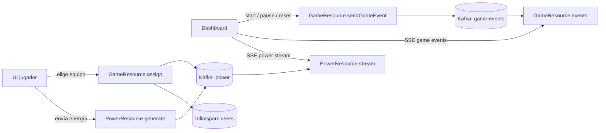

# DevOpsDays Santiago 2026 — Carrera Espacial

Demo interactiva de **software supply chain**: los asistentes juegan desde el móvil, el operador dirige la carrera en un dashboard en vivo, y la app corre en **OpenShift** desplegada con **Backstage → GitHub → GHCR → Argo CD**.

## Demo en vivo (OpenShift)

| Rol | URL |
|-----|-----|
| **Jugadores** | https://dod-race-app-dod-race.apps.cluster-zvcvg.dyn.redhatworkshops.io/ |
| **Dashboard operador** | https://dod-race-app-dod-race.apps.cluster-zvcvg.dyn.redhatworkshops.io/dashboard |

**Login dashboard:** `developer` / `dodrace2026`

## El juego

1. Los jugadores abren la URL en el móvil, eligen **Tripulación Nebula** u **Órbita** y esperan el inicio.


2. El operador entra al dashboard, pulsa **Play** y la carrera comienza.


3. En el móvil, tocar el badge de Santi envía energía; en el tablero los equipos avanzan por el circuito.


4. Al terminar se muestra el equipo ganador y el ranking.


### Login del operador


## Golden path (Backstage)

Este repositorio se crea con el template **DoD Race App — Software Supply Chain** en Backstage:

1. **Scaffold** — genera `dod-race-app` (código) y `dod-race-app-gitops` (Helm + Argo CD).
2. **CI** — GitHub Actions construye la imagen y la publica en **GHCR**.
3. **CD** — Argo CD en `openshift-gitops` sincroniza el chart hacia el namespace `dod-race`.
4. **Plataforma** — Kafka (`platform`) e Infinispan compartidos en el cluster del workshop.

```
Backstage (local) → GitHub repos → GHCR → Argo CD → OpenShift (dod-race)
```

## Arquitectura

Dos UIs Quinoa/React: jugador (`/`) y operador (`/dashboard`). El backend Quarkus usa **Kafka** para energía y eventos de juego, e **Infinispan** para estado compartido.



## Desarrollo local

Requisitos: **JDK 17+** (recomendado 21).

```bash
./mvnw quarkus:dev
```

- Jugadores: http://localhost:8080/
- Dashboard: http://localhost:8080/dashboard

### Simular jugadores

```bash
jbang scripts/GameLoader.java http://localhost:8080
```

Abre el dashboard y pulsa **Play** mientras corre el script.

## Personalizar

Archivo principal: [`src/main/webui/src/Config.js`](src/main/webui/src/Config.js)

| Constante | Uso |
|-----------|-----|
| `TEAMS_CONFIG` / `TEAM_LABELS_ES` | Equipos, colores y sprites Santi |
| `TAP_POWER`, `NB_TAP_NEEDED_PER_USER` | Velocidad de la carrera |
| `ENABLE_TAPPING`, `ENABLE_SHAKING`, … | Controles del jugador |
| `RACE_MAP_IMAGE` | Imagen del circuito en el dashboard |

## Contenedor e imagen

```bash
./mvnw package
docker build -f src/main/docker/Dockerfile.jvm -t ghcr.io/<org>/dod-race-app:latest .
```

En el workshop la imagen se publica automáticamente vía **GitHub Actions** al hacer push a `main`.

## Repos del workshop (ejemplo)

- **App:** [github.com/fmenesesg/dod-race-app](https://github.com/fmenesesg/dod-race-app)
- **GitOps:** [github.com/fmenesesg/dod-race-app-gitops](https://github.com/fmenesesg/dod-race-app-gitops)

## Más documentación

- TechDocs: [`docs/index.md`](docs/index.md)
