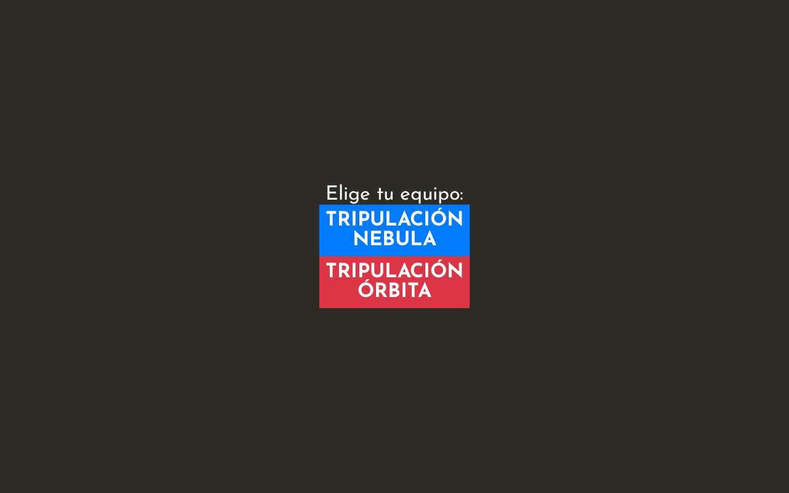

# Carrera Espacial — DevOpsDays Santiago 2026

Demo de cadena de suministro de software con Quarkus, Kafka, Infinispan y despliegue GitOps en OpenShift.

## URLs de la demo

- **Jugadores:** https://dod-race-app-dod-race.apps.cluster-zvcvg.dyn.redhatworkshops.io/
- **Dashboard:** https://dod-race-app-dod-race.apps.cluster-zvcvg.dyn.redhatworkshops.io/dashboard (`developer` / `dodrace2026`)

## Flujo del juego


Los jugadores eligen tripulación y esperan en la sala. El operador inicia la partida desde el dashboard.



Durante la carrera, la energía de los taps se publica en Kafka y el tablero actualiza las posiciones en tiempo real.


## Stack

- **Frontend:** Quinoa + React (jugador y dashboard)
- **Backend:** Quarkus 3.x
- **Mensajería:** Kafka (`power`, `game-events`)
- **Estado:** Infinispan
- **Deploy:** Helm + Argo CD → OpenShift

## Desarrollo

```bash
./mvnw quarkus:dev
```

Ver [README.md](../README.md) para personalización y scripts de carga.
