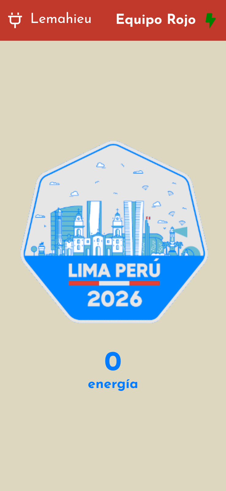
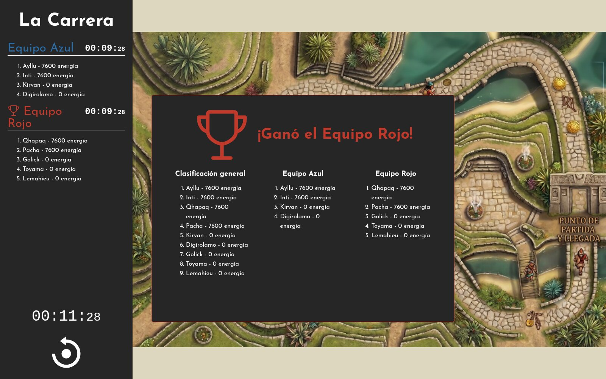
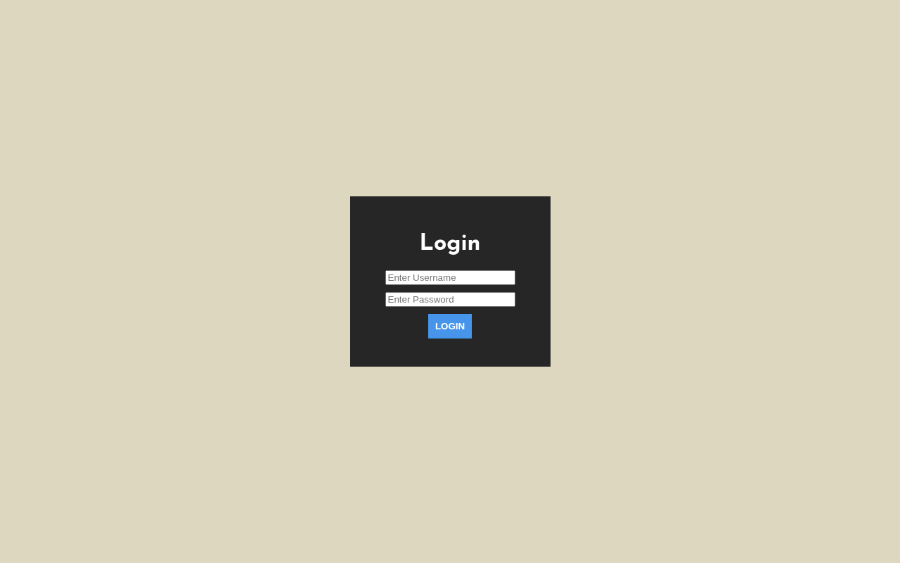

# DevOpsDays Santiago — Carrera Espacial

Demo Quarkus + Quinoa: Carrera Espacial en equipo. Los jugadores se unen desde el móvil, generan energía y el dashboard muestra la carrera en vivo.

## El juego

Antes de arrancar, los jugadores eligen equipo y esperan la partida.


El operador usa el dashboard para iniciar la carrera.


Durante la carrera, ambos equipos generan energía y las naves avanzan por el circuito orbital.


En el móvil, los jugadores tocan el badge para enviar energía.



Al final, el dashboard muestra el equipo ganador y la clasificación.



### Dashboard (login)

La pantalla `/dashboard` está protegida. Credenciales por defecto: `developer` / `dodrace2026`.



## Correr en modo dev

```bash
./mvnw quarkus:dev
```

- Jugadores: http://localhost:8080/
- Dashboard: http://localhost:8080/dashboard

## Personalizar

Ver `src/main/webui/src/Config.js` para equipos, potencia y sensores.
